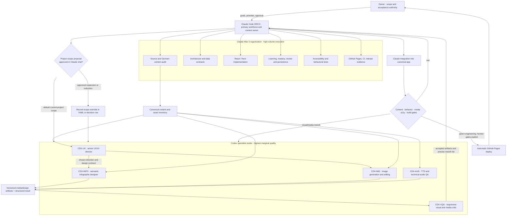
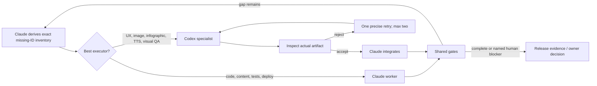

# Claude–Codex Organization and Delivery Flow

Status: project operating view  
Machine-readable authority: `../config/claude-codex-operating-model.yaml`

## Fast operating loop

The diagrams describe roles, not simultaneous permanent processes. Claude starts only the workers needed for the current inventory and stops them when their bounded artifacts are accepted.
