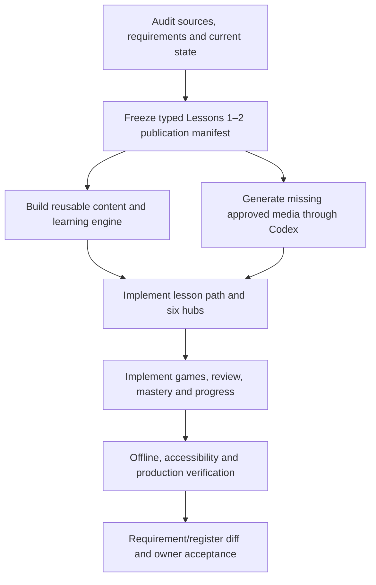

# German Learning OS — Lessons 1–2 Full Alpha Delivery Plan

| Item | Value |
|---|---|
| Status | EXECUTION AUTHORIZED — active user goal; do not call complete until every required gate is evidenced |
| Plan authority | Supersedes the execution status assumptions in `clean-rebuild-blueprint.md`; that file remains historical planning evidence |
| Orchestrator | Codex parent session |
| Cursor implementation models | `cursor-grok-4.5-high` for implementation; `composer-2.5` High, non-Max, for Cursor-side review |
| Media authority | Codex only for original illustrations, infographics and generated voice |
| Canonical scope | Momente A1.1 Lessons 1–2 plus the attached 48-row teacher professions collection |
| Completion authority | Requirement/register diff + acceptance evidence + owner sign-off; the visual showcase is not completion evidence |

## 1. Objective and non-goals

Deliver a responsive local-first learning platform in which a learner can:

1. complete Lesson 1 and Lesson 2 in sequence or open either directly;
2. learn every verified coursebook/workbook/glossary concept and the 48-row teacher collection;
3. move between a lesson and global Vocabulary, Verbs, Grammar, Phrases & Q&A, Listening and Concepts hubs;
4. practice through recall, listening, construction and speaking activities;
5. tag, search, review and revisit weak concepts through mixed gamified missions;
6. hear fast-starting, reviewed German pronunciation from cached static audio;
7. inspect source, lesson, priority and validation status for every published concept.

Non-goals for this Alpha remain authoritative pronunciation scoring, open-ended AI conversation, public redistribution of publisher audio, multi-user sync, teacher administration and whole-book publication.

## 2. Truthful current baseline — 2026-08-07

The current `samples/german-learning-ui-samples/` application is an approved visual and interaction baseline, not the full Alpha.

| Area | Current evidence | Status |
|---|---|---|
| Documentation | 17 ordered product/UX/data/media/QA documents plus decision ledger | strong foundation; implementation traceability still incomplete |
| Lessons | two overview pages with representative actions | partial; no generic staged activity engine or stable activity routes |
| Canonical content | two compact lesson records, 48 teacher rows | partial; grouped arrays and candidate rows are not assertion-level canonical objects |
| Hubs | vocabulary, verbs, grammar, phrases, listening and review views | partial; filters, typed search, learned/all scope and concepts hub are incomplete |
| Games | flashcards, article choice and feminine-form puzzle | partial; picture match, audio match, word order and verb builder are missing |
| Learner state | local XP, difficult flags, heard/completed counts | partial; no event history, multidimensional mastery, scheduler or export/import |
| Audio | 327 cached Edge neural clips and a 15-track rights-gated workbook map | implemented technically; human German QA and per-object completeness remain gates |
| Responsive behavior | tested desktop/tablet/mobile visual slice | passing for current routes only |
| Production preview | Vite Preview works; `vinext start` did not mount `/assets/*` | corrected in package command; production E2E must remain a release gate |

## 3. Locked product and content decisions

- Lessons and hubs are two views of the same canonical objects.
- Source priority is glossary → course/workbook → teacher material → personal enrichment.
- Each published field carries assertions, not just a file-level source label.
- Core lesson completion and teacher-extra mastery are measured separately.
- Gender tokens are semantic: masculine blue, feminine rose, neuter amber, plural violet; every token also has text/shape.
- Morphology tokens are separate from gender tokens.
- Cached `de-DE-KatjaNeural` at `+4%` remains the approved Alpha voice.
- Publisher audio remains private until redistribution or authenticated-use authority is recorded.
- Views and multiple-choice recognition cannot by themselves create mastery.
- Cursor never invents German, sources, images or audio; it reports a structured gap.

## 4. Standing guardrails

| Rule | This plan |
|---|---|
| Parallel fan-out requires sibling workers with disjoint write ownership | applies only after Cursor authentication is proven; no fake fan-out while blocked |
| Verify every artifact path before accepting a packet | applies |
| Meta/SkillOpt work | none; never blocks delivery |
| UI option promotion | current approved sample is the baseline; material redesign requires three rendered options and owner pick |
| External waits | report and continue independent work; never claim an unavailable provider ran |
| Decisions are rows | applies; substitutions update `DECISIONS.md` and the register |
| Original resources immutable | applies |
| No secret in project/browser/log/artifact | applies |

## 5. Continuous orchestrator

Codex owns the plan baton, requirement/register audit, content/media judgment and final verification. Cursor receives only bounded packets with explicit write paths. Cursor output is untrusted until Codex verifies the files and gates. Codex may implement safety or unblocker fixes directly, but substantial Cursor-owned feature work is accepted only after the requested model identity is evidenced.

The baton is `plans/PLAN-BATON-full-alpha.md`. The machine register is `plans/full-alpha-register.csv`.

## 6. Ownership roster

| ID | Role | Engine/model | Owns (write only) | Forbidden | Toolkit shortlist |
|---|---|---|---|---|---|
| ORCH | coordination and final judgment | Codex parent | plan, baton, gate notes, decisions | claiming feature completion from prose | Read, rg, tests, browser evidence |
| C-DATA | schemas, validators, indexes, ingestion adapters | Cursor `cursor-grok-4.5-high` | `platform/package*.json`, `platform/tsconfig.json`, `platform/README.md`, `platform/packages/content/**`, `platform/content/**`, `platform/tests/content/**` | media generation; German invention | TypeScript, JSON Schema, source manifests |
| C-ENGINE | activity, mastery, scheduler, persistence | Cursor `cursor-grok-4.5-high` | `platform/packages/learning/**`, engine tests | UI redesign; media | reducers, deterministic clocks, FSRS adapter contract |
| C-UI | shell, routes, lessons, hubs, games | Cursor `cursor-grok-4.5-high` | `platform/apps/web/**`, UI/E2E tests | changing content or semantic tokens | React, accessibility, Playwright |
| C-REVIEW | Cursor-side adversarial review | Cursor `composer-2.5`, High non-Max | review reports only | edits; Max/Fast models | diff review, acceptance matrix |
| X-MEDIA | original image/infographic/audio generation | Codex | `media/generated/**`, media manifests | publisher-art copying; undocumented regeneration | image generation, Edge TTS, checksum manifests |

## 7. Delivery flow



## 8. Phases and gates

### P0 — Inventory and scope reconciliation · Gate G0

- Index every immutable source with checksum, type, language, scope and rights state.
- Reconcile the 77-message session, later decisions, requirements and screen contracts.
- Produce a current-state matrix that labels each MUST as proven, partial, missing or blocked.

G0 GREEN: 100% of MUST IDs occur once in the matrix; all original files are indexed; no source is silently promoted.

### P1 — Canonical content publication package · Gate G1

- Replace tuple/group content with typed Lesson, Lexeme, Verb, GrammarConcept, PhrasePattern, QAPair, Dialogue, ListeningAsset, Collection and LearningActivity objects.
- Encode assertion-level provenance and validation state.
- Preserve the 48 teacher rows while deduplicating canonical concepts through relationships.
- Encode 12 required activities per lesson and explicit content/media gaps.

G1 GREEN: two lessons, 24 required activity IDs, 48 teacher source rows, all documented verbs/Q&A patterns, 15 verified workbook mappings, zero broken relationships and zero Lesson 3+ objects in the public bundle.

### P2 — Content and learning engine · Gate G2

- Implement schema validation, scope firewall, indexes, typed search and media resolution.
- Implement event history, mastery dimensions, review card state, deterministic mission generation and versioned export/import.
- Keep persistence behind an adapter so local storage can later be replaced.

G2 GREEN: invalid fixtures fail; duplicate and relationship checks pass; reload/export/import reproduce state; page views and one lucky MCQ cannot create mastery.

### P3 — Lesson journey and cross-linked hubs · Gate G3

- Implement stable lesson overview/stage/activity routes and resume.
- Implement six hubs with learned/all, lesson, priority, category, mastery, tag and due filters.
- Implement typed global search and back-context preservation.
- Render vocabulary, verbs, grammar, phrases/Q&A, listening and concepts from the same canonical records.

G3 GREEN: all six hubs exist; all 24 lesson activities resolve; the same representative concept opens correctly from lesson, hub, search and review; browser back restores context.

### P4 — Practice, speaking and review · Gate G4

- Implement flashcards, picture/word match, article sort, audio match, word order, verb builder and word puzzle.
- Implement model → guided → constructed → spoken Q&A progression.
- Implement microphone permission, record, stop, playback, retry and navigation cleanup without claiming AI scoring.
- Implement mixed daily mission, tags, notes, weak-skill targeting, XP and streak rules.

G4 GREEN: seven game modes emit typed attempts; mission mixes recognition/recall/listening/production; microphone denial and navigation races pass; difficult/failed concepts enter review.

### P5 — Codex media lane · Gate G5

- Generate original coherent infographic/illustration families and required responsive variants.
- Generate only missing pronunciation clips under the approved voice profile.
- Perform text/form, naturalness and consistency listening passes; record reviewer and status.

G5 GREEN: every published core form/model sentence has approved audio or a blocking gap; required visual families have desktop/mobile variants and alt descriptions; no publisher/teacher artwork is public.

### P6 — Release verification · Gates G6 and G-OWNER

- Run schemas, content validators, unit, integration, lint, typecheck, build and production-server E2E.
- Run 1440×1000, 820×1080, 390×844 and 360×800 visual/reflow checks.
- Run keyboard, screen-reader semantics, reduced-motion, contrast and microphone tests.
- Produce source coverage, media QA, known limitations, version and rollback evidence.

G6 GREEN: every required automated/human gate is evidenced and the register ID diff is empty. G-OWNER remains pending until the owner accepts the Alpha.

## 9. Cursor packet order

1. `C0-schema-and-validation`
2. `C1-publication-bundle-and-indexes`
3. `C2-event-mastery-review-engine`
4. `C3-shell-routes-settings`
5. `C4-lesson-engine`
6. `C5-six-hubs-and-search`
7. `C6-seven-games-and-speaking`
8. `C7-offline-export-progress`
9. `C8-release-hardening`
10. `C9-composer-review`

Every packet brief must contain requirement IDs, read-first paths, write-only paths, forbidden actions, exact tests and returned evidence. Cursor authentication and the requested model identity are a precondition; otherwise the packet remains pending and Codex continues only independent content/media/audit work.

## 10. OPEN, PINNED and TBD

| Item | State | Close authority |
|---|---|---|
| Qualified German review of candidate vocabulary and every generated-audio batch | OPEN | owner-designated German reviewer |
| Publisher audio redistribution/authenticated-use basis | OPEN | owner/legal rights evidence |
| Edge voice/profile for Alpha | PINNED | owner through superseding ADR |
| Grok 4.5 High + Composer 2.5 High non-Max Cursor policy | PINNED | owner |
| Authoritative pronunciation scoring | TBD/post-Alpha | benchmark/provider/privacy decision |
| Public deployment | OPEN | production runtime + release gates + owner approval |

## 11. Final completion audit

Completion requires all of the following, not a subset:

- register missing-ID count = 0;
- every MUST requirement has direct current-state evidence;
- source/media/publication manifests validate;
- Lessons 1–2 and the 48 teacher rows are fully reconciled;
- 24 lesson activities, six hubs and seven games work through canonical data;
- learner state proves mastery/review behavior across reload/export/import;
- production build and production server pass browser journeys;
- independent reviews have no unresolved high-severity finding;
- OPEN items are either still openly limiting release or closed by their named authority;
- owner signs G-OWNER.

## 12. Machine-readable steps register

```json steps-register
{
  "steps": [
    {"id":"P0-01","title":"Requirement-to-current-evidence matrix","artifact":"docs/17-current-state-and-completion-matrix.md","owner":"ORCH","acceptance":{"files":1,"requirement_ids":49,"missing_ids":0},"gate_ref":"G0"},
    {"id":"P0-02","title":"Immutable source inventory with checksums","artifact":"content/source-index/source-manifest.json","owner":"C-DATA","acceptance":{"manifests":1,"unhashed_files":0},"gate_ref":"G0"},
    {"id":"P0-03","title":"Session and later-decision reconciliation","artifact":"docs/00-session-decision-ledger.md","owner":"ORCH","acceptance":{"source_messages":77,"unmapped_user_requirements":0},"gate_ref":"G0"},
    {"id":"P0-04","title":"Requirement UX data and test traceability","artifact":"docs/18-requirement-traceability.md","owner":"ORCH","acceptance":{"requirement_ids":49,"missing_ids":0},"gate_ref":"G0"},
    {"id":"P1-01","title":"Typed canonical schema package","artifact":"platform/packages/content","owner":"C-DATA","acceptance":{"schema_packages":1},"gate_ref":"G1"},
    {"id":"P1-02","title":"Lesson 1 publication manifest","artifact":"platform/content/published/lesson-01.json","owner":"C-DATA","acceptance":{"lesson_manifests":1},"gate_ref":"G1"},
    {"id":"P1-03","title":"Lesson 2 publication manifest","artifact":"platform/content/published/lesson-02.json","owner":"C-DATA","acceptance":{"lesson_manifests":1},"gate_ref":"G1"},
    {"id":"P1-04","title":"Teacher professions source-row reconciliation","artifact":"platform/content/published/teacher-professions.json","owner":"C-DATA","acceptance":{"source_rows":48,"unresolved_rows":0},"gate_ref":"G1"},
    {"id":"P1-05","title":"Required lesson activity records","artifact":"platform/content/published/activities.json","owner":"C-DATA","acceptance":{"activity_ids":24,"unresolved_ids":0},"gate_ref":"G1"},
    {"id":"P1-06","title":"Workbook audio mapping records","artifact":"platform/content/published/listening-assets.json","owner":"C-DATA","acceptance":{"mapped_tracks":15,"public_source_mp3":0},"gate_ref":"G1"},
    {"id":"P2-01","title":"Content validators and scope firewall","artifact":"platform/packages/content/src/validation","owner":"C-DATA","acceptance":{"validator_modules":1,"invalid_fixture_passes":0},"gate_ref":"G2"},
    {"id":"P2-02","title":"Typed indexes and search","artifact":"platform/packages/content/src/indexes","owner":"C-DATA","acceptance":{"index_modules":1},"gate_ref":"G2"},
    {"id":"P2-03","title":"Event and multidimensional mastery engine","artifact":"platform/packages/learning/src/mastery","owner":"C-ENGINE","acceptance":{"mastery_dimensions":6},"gate_ref":"G2"},
    {"id":"P2-04","title":"Review scheduler and mission generator","artifact":"platform/packages/learning/src/review","owner":"C-ENGINE","acceptance":{"review_modules":1},"gate_ref":"G2"},
    {"id":"P2-05","title":"Versioned export-import persistence","artifact":"platform/packages/learning/src/persistence","owner":"C-ENGINE","acceptance":{"persistence_adapters":1},"gate_ref":"G2"},
    {"id":"P3-01","title":"Stable lesson stage and activity routes","artifact":"platform/apps/web","owner":"C-UI","acceptance":{"activity_routes":24},"gate_ref":"G3"},
    {"id":"P3-02","title":"Six canonical hubs","artifact":"platform/apps/web","owner":"C-UI","acceptance":{"hub_routes":6},"gate_ref":"G3"},
    {"id":"P3-03","title":"Typed global search and back context","artifact":"platform/apps/web","owner":"C-UI","acceptance":{"search_routes":1,"back_context_journeys":4},"gate_ref":"G3"},
    {"id":"P4-01","title":"Required game modes","artifact":"platform/apps/web","owner":"C-UI","acceptance":{"game_modes":7},"gate_ref":"G4"},
    {"id":"P4-02","title":"Q&A conversation progression","artifact":"platform/apps/web","owner":"C-UI","acceptance":{"progression_levels":5},"gate_ref":"G4"},
    {"id":"P4-03","title":"Recorder lifecycle and failure states","artifact":"platform/apps/web","owner":"C-UI","acceptance":{"recorder_journeys":3},"gate_ref":"G4"},
    {"id":"P4-04","title":"Mixed mission tags notes XP and streaks","artifact":"platform/apps/web","owner":"C-ENGINE","acceptance":{"mission_skill_types":4,"tag_types":5},"gate_ref":"G4"},
    {"id":"P5-01","title":"Approved generated audio or explicit gaps","artifact":"media/manifests/alpha-tts-manifest.json","owner":"X-MEDIA","acceptance":{"audio_coverage_gaps":0},"gate_ref":"G5"},
    {"id":"P5-02","title":"Responsive original infographic families","artifact":"media/generated/infographics","owner":"X-MEDIA","acceptance":{"infographic_families":6,"responsive_variants_per_family":2},"gate_ref":"G5"},
    {"id":"P5-03","title":"Audio and visual human QA evidence","artifact":"research/media-qa","owner":"X-MEDIA","acceptance":{"review_passes":2},"gate_ref":"G5"},
    {"id":"P6-01","title":"Automated engineering and content gates","artifact":"research/release-evidence","owner":"C-REVIEW","acceptance":{"failed_required_gates":0},"gate_ref":"G6"},
    {"id":"P6-02","title":"Responsive accessibility and production E2E","artifact":"research/release-evidence","owner":"C-REVIEW","acceptance":{"viewport_baselines":4,"failed_required_journeys":0},"gate_ref":"G6"},
    {"id":"P6-03","title":"Requirement and register final diff","artifact":"research/release-evidence/completion-audit.json","owner":"ORCH","acceptance":{"missing_register_ids":0,"missing_requirement_ids":0},"gate_ref":"G6"},
    {"id":"P6-04","title":"Owner acceptance","artifact":"plans/PLAN-BATON-full-alpha.md","owner":"ORCH","acceptance":{"owner_approvals":1},"gate_ref":"G-OWNER"}
  ]
}
```
